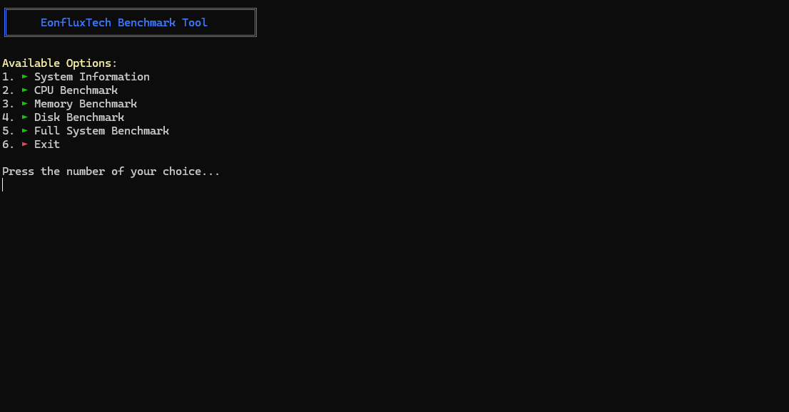

# EonfluxTech Benchmark Tool

A Windows-specific system benchmark and hardware information tool written in Rust. This tool provides comprehensive system information and performance benchmarks for CPU, Memory, and Disk operations.



## Features

### 1. System Information
- Detailed CPU information (brand, cores, frequency, usage)
- Memory status (total, available, used)
- Operating system details
- Real-time system monitoring

### 2. CPU Benchmark
- Multi-threaded performance testing
- Complex mathematical operations benchmark
- CPU usage monitoring
- Performance rating system

### 3. Memory Benchmark
- Read/Write speed tests
- Memory latency testing
- Memory usage monitoring
- Performance comparison

### 4. Disk Benchmark
- Sequential read/write tests
- Random access performance
- IOPS measurement
- Disk information display

### 5. Full System Benchmark
- Comprehensive testing of all components
- Detailed report generation
- Overall system rating
- Performance comparison

## Requirements

- Windows 10 or 11
- Rust 1.70 or higher
- Visual Studio Build Tools (for compilation)

## Installation

1. Clone the repository:
```bash
git clone https://github.com/yourusername/EonfluxTech-Benchmark.git
cd EonfluxTech-Benchmark
```

2. Build the project:
```bash
cargo build --release
```

3. Run the benchmark tool:
```bash
cargo run --release
```

## Implementation Details

### Core Components

#### 1. System Information Module
```rust
fn show_system_info(&mut self) {
    self.sys.refresh_all();
    
    // OS Info
    println!("Operating System:");
    println!("► Name: {}", self.sys.name().unwrap_or_else(|| "Unknown".to_string()));
    println!("► Version: {}", self.sys.os_version().unwrap_or_else(|| "Unknown".to_string()));
    
    // CPU Info
    if let Some(cpu) = self.sys.cpus().first() {
        println!("► Brand: {}", cpu.brand());
        println!("► Cores: {}", self.sys.cpus().len());
        println!("► Frequency: {} MHz", cpu.frequency());
    }
}
```

#### 2. CPU Benchmark Implementation
```rust
fn run_cpu_benchmark(&mut self) {
    let duration = Duration::from_secs(5);
    let start_time = Instant::now();
    let mut operations = 0u64;

    while start_time.elapsed() < duration {
        let mut rng = rand::thread_rng();
        let n: f64 = rng.gen();
        let _result = (0..1000).fold(n, |acc, _| {
            (acc.sqrt().sin() * acc.cos()).exp()
        });
        operations += 1;
    }

    let score = operations as f64 / duration.as_secs_f64();
    println!("► Operations per second: {:.2}", score);
}
```

#### 3. Memory Benchmark Implementation
```rust
fn run_memory_benchmark(&mut self) {
    let mut data = vec![0u8; MEMORY_TEST_SIZE];
    
    // Write speed test
    let write_start = Instant::now();
    for chunk in data.chunks_mut(CHUNK_SIZE) {
        for byte in chunk.iter_mut() {
            *byte = rng.gen();
        }
    }
    let write_speed = MEMORY_TEST_SIZE as f64 / write_start.elapsed().as_secs_f64() / 1024.0 / 1024.0;
    
    // Read speed test
    let read_start = Instant::now();
    let mut checksum = 0u64;
    for chunk in data.chunks(CHUNK_SIZE) {
        for &byte in chunk {
            checksum = checksum.wrapping_add(byte as u64);
        }
    }
    let read_speed = MEMORY_TEST_SIZE as f64 / read_start.elapsed().as_secs_f64() / 1024.0 / 1024.0;
}
```

#### 4. Disk Benchmark Implementation
```rust
fn run_disk_benchmark(&mut self) {
    let test_file = "disk_benchmark_test.tmp";
    let mut file = OpenOptions::new()
        .read(true)
        .write(true)
        .create(true)
        .truncate(true)
        .open(test_file)?;

    // Sequential Write Test
    let mut buffer = vec![0u8; DISK_CHUNK_SIZE];
    let write_start = Instant::now();
    while total_written < DISK_TEST_SIZE {
        rng.fill(&mut buffer[..]);
        file.write_all(&buffer)?;
    }
    let write_speed = DISK_TEST_SIZE as f64 / write_start.elapsed().as_secs_f64() / 1024.0 / 1024.0;
}
```

### User Interface

The tool uses a clean, terminal-based interface with:
- Color-coded output using the `colored` crate
- Progress bars using `indicatif`
- Clear screen management using `crossterm`
- Interactive menu system

```rust
fn display_menu(&self) -> std::io::Result<()> {
    println!("{}", "╔══════════════════════════════════════╗".bright_blue());
    println!("{}", "║     EonfluxTech Benchmark Tool      ║".bright_blue());
    println!("{}", "╚══════════════════════════════════════╝".bright_blue());
    println!();
    println!("{}:", "Available Options".bright_yellow());
    println!("1. {} {}", "►".bright_green(), "System Information");
    println!("2. {} {}", "►".bright_green(), "CPU Benchmark");
    // ... more menu items
}
```

## Performance Ratings

The tool uses the following rating system:

### CPU Performance
- Excellent: > 1,000,000 ops/s
- Very Good: > 750,000 ops/s
- Good: > 500,000 ops/s
- Fair: > 250,000 ops/s

### Memory Performance
- Excellent: > 10,000 MB/s
- Very Good: > 7,500 MB/s
- Good: > 5,000 MB/s
- Fair: > 2,500 MB/s

### Disk Performance
- Excellent: > 1,000 MB/s
- Very Good: > 500 MB/s
- Good: > 250 MB/s
- Fair: > 100 MB/s

## Contributing

Contributions are welcome! Please feel free to submit a Pull Request.

## License

This project is licensed under the MIT License - see the LICENSE file for details.

## Acknowledgments

- `sysinfo` crate for system information retrieval
- `colored` crate for terminal colors
- `indicatif` for progress bars
- `crossterm` for terminal manipulation 